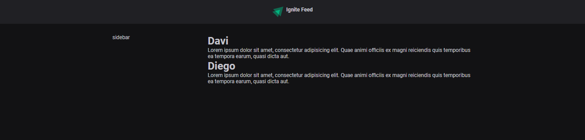

# Iniciando com React

  O React é uma biblioteca de criação de interfaces altamente interativas. Geralmente isso significa tudo aquilo que o usuário interage quando utiliza sua aplicação podendo ser na web, mobile, TVs e até em VR.
  
## Fundamentos do React
  Iniciando os fundamentos do React, sabemos que anteriormente na Web 1, as páginas eram estáticas, não tinha a adequação por usuário, uma página com caracterísicas específicas para cada usuário, era sempre a mesma pra todo e qualquer pessoa que acessasse.

  Conforme o tempo passou, foram criados diferente formas de criação de sites na web. Primeiramente citaremos aqui os Padrões de Renderização ou Rendering Patterns, entre eles os que vamos descrever a seguir.


  ### SSR (Server Side Rendering)
  Sempre que o usuário/browser faz uma requisição para o servidor, este possui código tanto front-end como back-end. O Back cria e faz a busca no banco de dados e devolve o html, css, js, pronto para o servidor carregá-lo. A tela fica branca enquanto carrega, geralmente é assim que podemos verificar, ela é presente em muitas aplicações da web hoje.

  ### SPA (Simple Page Aplication)
  A maioria das aplicações estão vindo com esse padrão de renderização. O browser ao acessar uma rota, o back-end busca no bando de dados, mas não ele não possui mais a compreensão de código html, css, js, ou seja, ele não possui mais a responsabilidade pela compreensão visual da tela/aplicação.
  
  Na verdade ele vai apenas retornar os dados para o usuário, geralmente no formato JSON (JavaScript Object Notation), uma estrutura "universal" pois ele consegue ser interpretado por qualquer linguagem.

  Nesse padrão em resumo ao invés de apenas uma aplicação com front e back-end para devolução de requisições, nós vamos ter duas ou mais aplicações divididas, uma com o back-end que retorna os dados em JSON e outra que obtém os dados em JSON e converter para HTML, CSS e JS.

  Podemos ter múltiplos front-ends consumindo a mesma fonte de dados em JSON.


## Bundlers & Compilers

- Compilers
  - São ferramentas que convertem o nosso código para um formato que outra máquina possa entender. No caso do JavaScript é o babel que converte código em uma versão mais básica que seja fácil de ser compatível com qualquer browser.

- Bandlers
  - Os bandlers entende e converte importações e exportações dentro da nossa aplicação em um único arquivo de bundle que é compatível com os browsers.
  No caso do JS, temos o Webpack, muito famoso na comunidade.

_Dica: O site [Can I Use](www.caniuse.com) mostra para nós o que os browsers atualmente suportam._

  Em resumo, precisamos de compiladores pois nem todos os browsers e ambientes vão entender o código em sua última versão, e os bundlers por conta do suporte ou da falta de suporte dos browsers a entender importações entre arquivos JavaScript.

O Vite e o Snowball são alternativas para criação de projetos javaScript, pois eles utilizam EcmaScript modules nativos, então não é necessário bundling e ele próprio já faz o processo de compiling automático, então com eles não é necessário o uso de Webpack e Babel.

## Criando um projeto React usando Vite

  Criando um projeto com os seguintes comandos:
  ```js 
  // yarn
  yarn create vite

  // npm
  npm create vite@latest
  ```

  O Vite iniciará o processo de criação do projeto com passos para o nome do projeto, template utilizado e qual linguagem utilizar. O usuário também pode configurar no momento do comando se assim desejar.

  Para nossa aplicação optamos por utilizar React com tamplate em javascript para o passo a passo em torno dos fundamentos do React e da utilização do typescript.

  Após criar o projeto, entramos na pasta dele e utilizamos o comando `yarn` ou `npm i` ou `npm install` assim teremos a seguinte organização dos arquivos:

  

  No terminal, já podemos utilizar o comando `npm run dev` ou `yarn dev`

  O servidor abrirá uma porta onde deverá rodar o nosso projeto. Daqui em diante vamos entender um pouco mais sobre os arquivos principais em que se encontra o corpo projeto.

  

  Dentro da pasta _`/src`_ temos vários arquivos. Excluimos todos os de estilização, os que terminam com *__.css__*, e retiramos suas importações dos arquivos `App.jsx` e `main.jsx`.

  Dentro de __App.jsx__, no retorno a função, retiramos todo o html, com exceção da tag que contorna o todo. Dentro dela colocamos a tag \<h1> com a mensagem "Hello World".

```javascript
// App.jsx
function App() {
  return (
    <>
      <h1>Hello World</h1>
    </>
  )
}

export default App
```

  No nosso arquivo `main.jsx` temos a nossa configuração do ambiente React.

``` javascript
import React from 'react'
import ReactDOM from 'react-dom/client'
import App from './App.jsx'

ReactDOM.createRoot(document.getElementById('root')).render(
  <React.StrictMode>
    <App />
  </React.StrictMode>,
)
```

  A importação React de 'react' é o coração da biblioteca react que utilizamos para que todos os componentes dela consigam ser utilizados e configurados de forma correta. É nossa importação que nos dá acesso as diferentes formas que o react assume, seja na web, mobile, tv ou VR.

  A ReactDOM da 'react-dom/client' é a importação que nos dá acesso a árvore de elementos HTML ou a DOM (Documentation Object Model) trazendo a partir dela elementos criados no javascript como elementos html na aplicação.

  O método `createRoot()` indica qual elemento html será utilizado para randerizar toda a árvore de elementos do React no HTML. Nesse caso será o elemento com id='root' e o elemento a ser randerizado será o `<App />` que está dentro do componente `<React.StrictMode>`

  O elemento no qual nosso arquivo `main.jsx` está referenciando se encontra dentro do arquivo index.html, que está na raiz do nosso projeto.

```javascript
<!doctype html>
<html lang="en">
<head>
  <meta charset="UTF-8" />
  <link rel="icon" type="image/svg+xml" href="/vite.svg" />
  <meta name="viewport" content="width=device-width, initial-scale=1.0" />
  <title>Vite + React</title>
</head>
<body>
  <div id="root"></div>
  <script type="module" src="/src/main.jsx"></script>
</body>
</html>
```

  Como podemos observar, é um html simples que a partir da tag \<script> já utilizando o formato de importação e exportação que o 'vite' faz para nossa aplicação usando dentro da tag \<script> `type='module'`. Logo após essa propriedade temos o arquivo no qual o html recebe os componentes a página, `src="src/main.jsx"` .

## Componentes

  O principal conceito que DEVE ser conhecido antes de se trabalhar com React é o conceito de componente.

  > Basicamente, o componente funciona como o desacoplamento de um pedaço de código da aplicação que pode ser reinserida várias vezes em outras partes do código com informações diferentes.

  A extensão JSX tem relação direta com os componentes. JSX significa Javascript + XML, ou seja, é javascript aliado a uma linguagem de marcação como HTML.

  #### ___Export default vs. named exports___
  Existem diferentes formas de importar e exportar funções, a primeira delas é a _"named exports"_ nela você pode exportar qualquer função, qualquer componente e nomea-lo da forma que desejar sem que ocorra erro.
  
  Já no _"export default"_ a função não pode ser renomea-da em uma importação, ela deve ser usada com o nome da forma que foi criada. Geralmente o uso de cada um dos tipo depende, mas cada uma tem sua vantagem específica.

```javascript
// Named Exports

// Post.jsx
function Post() {
  return <p>Post</p>
}

export default Post;

// App.jsx
import PostComponent from "./Post";

export function App() {
  return (
    <PostComponent />
  )
}
```

```javascript
// Exports default

// Post.jsx
export function Post() {
  return <p>Post</p>
}

// App.jsx
import { Post } from "./Post";

export function App() {
  return (
    <Post />
  )
}
```

## Propriedades

  Como em muitas tags html, existem os atributos, \, \<a> entre outras tags possuem atributos como "src" e "href". Dentro dos componentes existem as nossas propriedades que podem ser criadas ou extendidas de outros componentes. Elas se assemelham muito aos atributos das tags html.

```javascript
import { Post } from "./Post";

export function App() {
  return (
    <>
      <Post 
        author="Davi" 
        content="Lorem ipsum dolor sit amet consectetur adipisicing elit. A voluptas dicta nisi pariatur nulla iusto deleniti molestiae earum quibusdam quasi! Molestias veniam recusandae dolorem soluta quis. Ab at eaque dolorem."
      />

      <Post 
        author="Outro autor" 
        content="Lorem ipsum dolor sit amet consectetur adipisicing elit. A voluptas dicta "
      />
    </>
  )
}
```

  A principal utilidade dessa propriedades é estabelecer diferentes tipos de conteúdo usando um mesmo componente com a mesma estilização e mesma funcionalidade.

  Para recebermos essas propriedades nos componentes, utilizamos o termo *"props"* dentro das variáveis da função do componente. Em seguida usamos as propriedades herdadas nos locais do componente que criamos.

```javascript
export function Post(props) {
  return (
    <div>
      <strong>{props.author}</strong>
      <p>{props.content}</p>
    </div>
  )
}
```

  Dessa forma cada componente poderá ser formado por diferentes conteúdos.

# Estrutura da aplicação

## CSS Modules

  Para fazermos nossa estilização no React, podemos simplesmente criarmos nosso arquivo CSS e importa-lo. Diferente de como era a importação dos estilos dentro da página HTML, no React nos podemos apenas importa-los como fazemos com os componentes.

```javascript
import "./style.css";

export function App() {
  return (
    <>
      <Header/>
    </>
  )
}
```

  Existe um deslize no React que pode acabar acontecendo algumas vezes com a estilização de seus componentes. Ao dedicar classes a alguns componentes, alguns nomes podem se chocar, para resolver essa questão, temos o Css Modules.

  O Css modules já existe por padrão dentro da configuração do React e do Vite, para usá-lo basta criar um arquivo de estilização com a palavra ___'module'___ como em ___'style.module.css'___.

  Em resumo, após isso nós teremos a utilização de um css específico para determinado componente. Ao inspecionar o browser teremos o seguinte:
  


  O Css module, troca o nome da classe para um que se diferencie de outros, caso tornamos a usar o mesmo nome de classe em outro elemento. Assim ele deixa cada estilização específica para cada componente.

  Em relação a organização das pastas, criamos uma pasta chamada _"components"_ onde ficará todos os nossos componentes, geralmente separados por pastas com o nome de cada componente. Dentro de cada pasta de componente, usamos o nome do componente para criar seu arquivo de estilização, como por exemplo, no caso do componente _Header.jsx_ vamos ter o _Header.module.css_.

## CSS Global

  O CSS Global é uma forma de colocarmos uma estilização padrão para toda a nossa aplicação sem precisar coloca-la em todos os outros componentes.

  Geralmente colocamos a importação do arquivo _CSS_ na raiz da aplicação, no nosso caso, no arquivo `App.jsx`.

```javascript

import "./global.css";

```
  Algumas configurações padrões que a maioria coloca no arquivo global:

```css
/* No :root podemos adicionar algumas variáveis que serão úteis */
:root {
  /*
  Sintaxe padrão para adição de variáveis:
  --nome-da-var: valor;

  ex:
  --white: #FFF;
  --link-img: "./caminho/imagem.png";
  */
}

* {
  margin: 0;
  padding: 0;
  box-sizing: border-box;
}

body {
  /* 
  Aqui geralmente adicionamos a cor do background e
  a cor da fonte.
  */
}

body, input, textarea, button {
  /* 
  Aqui adicionamos a font-family, o tamanho da font e 
  o peso da fonte.
  */
}
```

## Componente Header

  Para implementação do componente Header, dentro da pasta de componentes `./src/components/` criamos os arquivos _"Header.jsx"_ e _"Header.module.css"_.

  > Ponto importante — Por padrão, os componentes devem ser criados com a primeira letra maiúscula, isso ajuda a diferenciar os elementos html dos componentes React, já que ambos existem no código.

  Como o próprio nome diz, o componente _Header_ será formado por uma tag \<header>, razão essa que temos o nome do componente com letra maiúscula.

```javascript
import styles from './Header.module.css'
import igniteLogo from '../assets/igniteLogo.svg'

export function Header() {
  return (
    <header className={styles.header}>
      
      <strong>Ignite Feed</strong>
    </header>
  )
}
```
  Os nomes das classes dos elementos dentro do componente estão dentro de chaves pois eles são representados pela variável styles que foi importada do css module do componente _Header_ como já vimos.

  O que há de novo até aqui é a forma de importação das imagens. Após baixarmos a imagem, colocamos ela dentro da pastas `./src/assets/` e de lá nós importamos usando o _"export default"_ como já vimos antes.

  Ao final da estilização temos o Header da seguinte forma:



## Componente: Sidebar

  O Componente Sidebar é composto por uma tag \<aside> e todos os elementos que ela compoe como \, \<footer>, etc.

```javascript
import styles from "./Sidebar.module.css";
import { PencilSimpleLine } from "@phosphor-icons/react";

export function Sidebar() {
  return (
    <aside className={styles.sidebar}>
      
      <div className={styles.profile}>
        

        <strong>Davi Santos</strong>
        <span>Web Developer</span>
      </div>
      <footer>
        <a href="#">
          <PencilSimpleLine size={20} />
          Editar seu perfil
        </a>
      </footer>
    </aside>
  )
}
```
  Algumas coisas novas que aprendemos nesse componente é que como as imagens serão dinâmicas de acordo com o usuário, elas não vão precisar de texto alternativo (\<alt>). Outra coisa importante é o uso de Icons importados via libs que baixamos.

  Utilizamos essas libs de ícones porque usar imagens baixadas sempre que precisarmos usar um ícone, acarretaria em um grande uso de links e baixaria uma quantidade de dados, o que deixaria a aplicação desnecessariamente pesada.

  No nosso caso baixamos o ___[Phosphor Icons](https://phosphoricons.com)___ através do `npm i @phosphor-icons/react` ou `yarn add @phosphor-icons/react`, para usarmos ele precisamos apenas importá-lo no componente que vamos usar e colocar o nome do ícone como componente na aplicação.

```css
.sidebar {
  background: var(--gray-800);
  border-radius: 8px;
  overflow: hidden;
}
```
  Algo interessante nesse trecho também, foi a explicação do overflow, que funciona como uma caixa. Basicamente ele expicita que tudo que estivar "overflow", ou seja, por fora da caixa, deve ser escondido.

  Também temos o uso da função `calc()` do css:
```css
.avatar {
  width: calc(3rem + 12px);
  height: calc(3rem + 12px);
  border-radius: 3px;
  border: 4px solid var(--gray-800);
  outline: 2px solid var(--green-500);
}
```

## Componente: Post

  Vamos começar esse componentes citando o processo de criação de componente. A organização é mto importante, mas não é bom criar diversas pastas logo no começo da criação da aplicação porque pode acabar deixando a aplicação mais pesada, mais complicada do que ela realmente é.

  Por essa e outras razões, não há necessidade de uma pasta para cada componente nessa aplicação por agora.

  Mais uma coisa que citamos aqui é quais os passos que devemos seguir. Em primeiro lugar, ao ver o design criado do componente, vamos pensar em qual _estrutura html_ usar, pensando o que cada item é e como ele deve ser representado.

  Em seguida, nós avaliamos a estilização da página e só então vamos para as funcionalidades.

  Em ordem temos:

- HTML e estruturação
- CSS ou estilização
- Funcionalidades

  A estrutura do post ficou a seguinte:
```javascript
// Post.jsx
<article className={styles.post}>
    <header>
      <div className={styles.author}>
        
        <div className={styles.authorInfo}>
          <strong>Davi Santos</strong>
          <span>Dev Front-end</span>
        </div>
      </div>
      <time title='8 de novembro às 8:30' dateTime='2023-11-08 08:30:00'>Publicado há 1h</time>
    </header>
    <div className={styles.content}>
      <p>Fala galeraa 👋</p>
      <p>Acabei de subir mais um projeto no meu portifa. É um projeto que fiz no NLW Return, evento da Rocketseat. O nome do projeto é DoctorCare 🚀</p>
      <p>👉{" "} <a href="#">jane.design/doctorcare</a></p>
      <p>
        <a href="#">#novoprojeto</a>{" "}
        <a href="">#nlw</a>{" "}
        <a href="">#rocketseat</a>
      </p>
    </div>
  </article>
```
  Algumas coisas que foram aprendidas nesse componente:
  
  - A tag \<time> é útil para adesão de conteúdo de datas e hora.
  - No React, o html não adere ao uso de vários espaços, então o espaço no React é feito com {' '}
  - Usar `.elemento + .elemento` no css, permite que nós estilizemos apenas o `.elemento` que possui um `.elemento` anterior a ele
  - Usar `.pai > .elemento` no css, nos permite estilizar somente o `.elemento` que é filho direto de `.pai`

## Formulário de comentários

  Agora vamos começar a criar a estrutura e estilização do formulário de comentários, aprendendo também de algumas propriedades novas como o :focus do CSS

  Em resumo, como já vimos antes, criamos uma parte dentro de Post para a parte de escrita de comentários de outros usuários. Para isso usamos uma tag de formulário.

```javascript
// ...
// Post.jsx
<form className={styles.commentForm}>
  <strong>Deixe seu feedback</strong>
  <textarea
    placeholder="Comente algo..."
  />
  <footer>
    <button type="submit">Publicar</button>
  </footer>
</form>
```
  Após feita a estrutura criamos a nossa estilização do formulário. Nessa parte, poemos destacar duas boas práticas interessantes.

```css
.commentForm textarea:focus {
  color: var(--gray-300);
  outline: 1px solid var(--green-800);
  border: 1px solid var(--green-800);
}

.commentForm button[type=submit] {
  padding: 1rem 1.5rem;
  background: var(--green-500);
  color: var(--white);
  font-weight: bold;
  border-radius: 8px;
  border: 0;
  cursor: pointer;
  transition: background 0.1s;
}
```
  No código CSS acima, temos a propriedade focus que altera quando um elemento da tela é clicado ou _"focado"_ pelo usuário. No caso da nossa aplicação, ao focar no _textarea_ do formulário dos comentários, o elemento irá ter uma borda e um outline de determinada cor verde, além da cor da fonte alterada.

  Outro assunto interessante, na parte do css, é que o botão de submissão do formulário só deve aparecer ao se ter o formulário do comentário em foco.

  Sendo assim, a visibilidade do elemento deve ficar escondida até o formulário estar em foco pelo usuário e podemos fazer isso com CSS.

```css
.commentForm footer {
  visibility: hidden;
  max-height: 0;  
}

.commentForm:focus-within footer {
  visibility: visible;
  max-height: none;

}
```
  Como os elementos filhos agregam a estilização do elemento pai, podemos deixar o elemento footer com ___visibility: hidden___ e ___max-height: 0___ fazendo com que todos os filhos não apareçam junto do pai.

  A propriedade __".commentForm:focus-within"__ especifica qual estilização o elemento a seguir deve ter quando o elemento **.commentForm** for focado pelo usuário. Dessa forma, o nosso footer e todos seus filhos terão sua visibilidade normal e sem altura máxima do elemento.

## Component: Comment
  
  Agora vamos começar a criar a estrutura do nosso componente de comentário, que exibirá cada comentário de um post do nosso feed.

```javascript
// Comment.jsx
<div className={styles.comment}>
  
  <div className={styles.commentBox}>
    <div className={styles.commentContent}>
      <header>
        <div className={styles.authorAndTime}>
          <strong>Lucas Matos</strong>
          <time title='8 de novembro às 8:30' dateTime='2023-11-08 08:30:00'>Cerca de 1h</time>
        </div>
        <button title="Deletar comentário">
          <Trash size={24} />
        </button>
      </header>
      <p>Parabéns pelo projeto, ficou incrível!</p>
    </div>

    <footer>
      <button>
        <ThumbsUp size={20} />
        Aplaudir<span>20</span>
      </button>
    </footer>
  </div>
</div>
```
  Relacionado ao uso de botões sem texto que são identificados apenas por ícones, é sempre bom colocarmos um título com a propriedade _"title"_ por acessibilidade.

  Dentro do Post utilizaremos esse componente dentro de uma div com className=_commentList_.

```javascript
// ...
// Post.jsx
<div className={styles.commentList}>
  <Comment />
  <Comment />
  <Comment />
</div>
```

## Componente: Avatar

  Vamos lembrar que temos 2 grandes momentos em que é aconselhável criarmos um componente.

<ol>
  <li>
    Quando alguma coisa repete mais de 2 vezes em tela, geralmente com o mesmo visual e mesmo comportamento.
  </li>
  <br>
  <li>
    Quando conseguimos tirar algo de um componente maior sem que aquele componente maior pare de funcionar.
  </li>
</ol>

  A imagem de usuário presente tanto na _sidebar_ como nós _comentários_ e nos _posts_ é um elemento que se repete várias vezes, possui um comportamento igual e com mesma estlização.

  Criamos a nossa estrutura do componente Avatar.jsx:
```javascript
export function Avatar({ hasBorder = true, src}) {
  return (
    
  )
}
```
  Ele é apenas uma tag img com dois tipos de estilos. Isso porque no componente _Sidebar_ e _Post_ a imagem de avatar possui borda estilizada enquanto que nos comentários não.

  Utilizando a desestruturação de objetos, temos nossas propriedade _"hasBorder"_ e _"src"_ uma que indica se o Avatar terá borda estilizada ou não e outra com a fonte da imagem.

  Substituindo a tag img dentro do componente _Comment_ temos:
```javascript
<Avatar hasBorder={false} src="https://fonteImagem.com/imagem.png" />
```

## Aplicando Responsividade

  Aqui é bem básico, vamos apenas alternar a visualização para diferentes dispositivos.
  
  No momento temos a estilização e responsividade apenas para web. Para alternarmos para visualização em dispositivos menores ou móveis podemos fazer o seguinte:

```css
/* App.module.css */
@media (max-width: 768px) {
  html {
    font-size: 87.5%;
  }

  .wrapper {
    grid-template-columns: 1fr;
  }
}
```
  A @media é uma ferramenta CSS para adapatar as estilizações para uma característica específica do documento ( geralmente para o tamanho da tela ), dessa forma podemos alterar a estilização para ficar responsivo em diferentes telas.

  